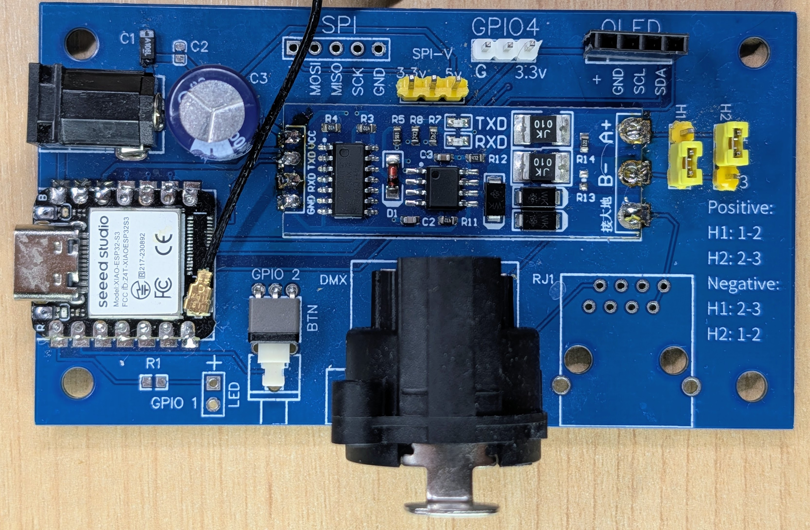

# ESP8266/ESP32 ArtNet Node

This project has evolved from a need to control a simple lights setup for community theater.
There are a few but very important concerns:

- **Low price**. Any investment is sensitive for a volunteer organization without a sponsorship. Even cheap chinese lights are mostly out of the budget since you cannot create a good setup using just a couple.
- **No lightning console**. Follows the price logic, meaning it has to be free. We use QLC+
- **Wireless**. That is very important when you do not have your own stage.

The initial inspiration was taken [from here](https://www.instructables.com/ESP8266-Artnet-to-DMX/).

The first and the most simple setup was using remote relays like Sonoff basic and smart plugs using ArtnNet over Wifi.
The next step was building our own dimmable LED lights but that appeared to be not very economically efficient compared to buying chinese from Amazon. Such lights (as well as professional ones) have DMX512 interface, so the third step was to implement an ArtNet-DMX bridge.
The next step was to use this platform for experimental devices like NepPixel light strips and servos, which opens the whole new world of possibilities for a DIY stage designer.

## Table of Contents

- [Device Types](#device-types)
    - [DIMMER](#dimmer)
    - [RELAY](#relay)
    - [SERVO](#servo)
    - [REPEATER](#repeater)
- [Controls](#controls)
    - [Indicator LED](#indicator-led)
    - [Button](#button)
    - [OLED Screen](#oled-screen)
- [WiFi connection and Captive Portal](#wifi-connection-and-captive-portal)
- [Web UI](#web-ui)
    - [Architecture](#architecture)
    - [Building and uploading](#building-and-uploading)
- [Variations](#variations)
    - [Sonoff Basic](#sonoff-basic)
- [REST API](#rest-api)
    - [GET /config](#get-config)
    - [GET /status](#get-status)
    - [POST /config](#post-config)
    - [POST /reboot](#post-reboot)
    - [POST /reset-wifi](#post-reset-wifi)
    - [GET /heap](#get-heap)
- [OTA](#ota)
- [Upgrading](#upgrading)
- [TODO List](#todo)
- [Build](#build)
- [Version History](#version-history)

## Device Types

One controller can utilize several DMX devices of different types (it has to work but wasn't properly tested other than 3 DIMMER channels on ESP8266).

- ESP8266 is limited to 4 DMX devices
- ESP32 is limited to 8

Such limits are not a memory or performance concern, or a result of testing, but rather random numbers.

### DIMMER

Uses **two** DMX channels starting at `channel`: `channel` translates the DMX value to PWM on the selected `pin`, and `channel + 1` controls strobe speed (0 = steady on, higher values = faster strobing - `pulse`/`multiplier` tune the strobe timing).

There is a global setting for PWM frequency - `freq`. See [GET config](#get-config)

`level` - TBD

```json
	"dmx": [
		{
			"channel": 10,
			"type": "DIMMER",
			"pin": 5,
			"level": "HIGH"
		}
	]
```

### RELAY

Uses one DMX `channel`. When a value reaches `threshold` the output `pin` changes its `level` to 'active' which could be either `HIGH` or `LOW`.

The JSON `type` for this device is `"BINARY"`, kept for compatibility with existing configs. `"RELAY"` is also accepted as an alias when POSTing `/config`, but `GET /config` will continue to return `"BINARY"`.

```json
	"dmx": [
		{
			"channel": 10,
			"type": "BINARY",
			"pin": 5,
			"level": "HIGH",
      "threshold": 127
		}
	]
```

### SERVO

TBD

### REPEATER

Repeater is used to connect a physical DMX512 interface.
RS485 adapter is required. ESP32 chips seem to have lower latency.

The whole ArtNet dataframe of 512 bytes will be sent to DMX512.

_Universe is ignored for now_

- ESP8266 uses UART1, `Serial1`
- ESP32 can use any GPIO pins that can be defined in the board config section in `platformio.ini`, otherwise default values will be used.

```json
	"dmx": [
		{
			"type": "REPEATER"
		}
	]
```

## Controls

### Indicator LED

#### Blinking patterns

- **Solid dimmed** - normal operating mode
- **Fast blinking** - trying to connect to WiFi
- **Slow blinking** - soft AP mode
- **Very fast blinking + repeated "FATAL" message on serial** - filesystem failed to mount; device halted in safe mode, serving a diagnostic page (chip ID, failure reason, re-flash instructions) from an open WiFi AP named `ArtNet-<chip id>-SAFE` at [192.168.4.1](http://192.168.4.1). Re-flash the firmware and filesystem image (`pio run -t upload` and `pio run -t uploadfs`)

### Button

#### Short press

Short press toggles the output for Relay/Binary DMX devices

#### Long press

Long press (longer than 5 seconds) will reset WiFi settings

### OLED Screen

TBD

## WiFi connection and Captive Portal

On startup, if a known WiFi network is not available or WiFi was never successfully connected before, Captive Portal starts and
is accessible via default IP address: [192.168.4.1](192.168.4.1)

If a known network comes back to life while the Captive Portal is active, the device will be automatically connected to it.

WiFi connection is constantly being checked every second. If connection is lost _after_ startup, the device keeps running - DMX devices, Art-Net, the web UI/API, etc. are unaffected - and a non-blocking reconnect to the last-known network is attempted every second in the background. The Captive Portal is **not** re-opened for a runtime disconnect; only a fresh boot without a working network falls back to the Captive Portal as described above.

## Web UI

Once the device is on your network, its home page (`http://<device-ip>/` or `http://<hostname>.local/`) is a configuration app - a [Preact](https://preactjs.com/) single-page application that drives the [REST API](#rest-api). It lets you:

- see the current firmware version and device info;
- set the hostname and Art-Net universe;
- add / edit / remove DMX devices;
- manage saved WiFi networks;
- change advanced hardware settings and enable HTTP auth (tucked behind an **Advanced** section, since a wrong pin can lock you out);
- **Reboot** the device or **Reset WiFi**, each with a confirmation.

Changes are saved one section at a time; when a change needs a restart, a "reboot required" banner appears. The app shares the same look as the [Captive Portal](#wifi-connection-and-captive-portal).

### Architecture

- **Source** lives in [`web/`](web/) - a Vite + Preact + TypeScript project: components under `web/src/`, and the shared stylesheet (`style.css`) plus the captive-portal page (`portal.html`) under `web/public/`.
- **`npm run build`** minifies everything into `data/www/` (`index.html`, `app.js`, `portal.html`, `style.css`). That output is **committed** to the repo, so building/flashing the firmware never requires Node - only changing the UI does.
- On the device the app is served straight from the LittleFS filesystem (`/www/`) by the same async web server that serves the REST API, so every call is same-origin (no CORS).
- There is no separate minification step in the firmware build any more - Node/Vite does it all.

### Building and uploading

You only need Node/npm when you change the UI.

```bash
cd web
npm install                              # once

# Live development against a real device (hot reload; REST + assets proxied):
DEVICE=http://<hostname>.local npm run dev

# Produce the minified bundle into ../data/www (commit the result):
npm run build
```

Then flash the filesystem image to the device from the repo root:

```bash
pio run -e <env> -t uploadfs             # writes data/ (web UI + default config) to LittleFS
```

`uploadfs` (and `buildfs`) automatically run `npm run build` for you first when Node/npm are installed (a `tools/build_web.py` PlatformIO hook; the first run also does `npm install`), so the flashed image is always fresh. Without the toolchain it prints a warning and flashes the committed `data/www/` as-is.

> Even with the auto-rebuild hook, re-run `npm run build` and **commit** `data/www/` after editing anything under `web/` - that committed output is what CI and Node-free machines (and OTA `littlefs.bin` uploads) actually serve.

## Variations

### Sonoff Basic

- [x] OTA is disabled
- [x] Only RELAY device type is supported

## REST API

### GET /config

Response example:

```json
{
    "configVersion": 1, // Schema version of the persisted config (informational; no migrations yet)
    "_needReboot": false, //reboot needed flag indicating config changes were not applied yet
    "hw": {
        "freq": 600, // PWM frequency
        "ledPin": 2, // GPIO pin cooected to indicator LED
        "buttonPin": 0, // GPIO pin connected to button
        "longPressDelay": 5000, // Duration in ms to cause a 'factory reset'
        "wifiPowerSave": false, // false (default) keeps the WiFi radio always on for lowest Art-Net latency / tightest multi-device sync; true re-enables modem sleep to save power
        "authEnabled": false, // If true, require HTTP basic-auth for POST /config, /reboot, /reset-wifi and /update
        "authUser": "", // Basic-auth username (used only if authEnabled)
        "authPass": "" // Basic-auth password (used only if authEnabled)
    },
    "info": {
        // Runtime WiFi/build/chip identity - same fields as GET /status, nested here for back-compat
        "id": "d6b6b8",
        "chip": "ESP32",
        "version": "2021.4",
        "built": "2026-06-13 14:05:21.993261",
        "max_dmx_devices": 8,
        "ssid": "BAM",
        "rssi": -47,
        "uptime": 123456,
        "free_heap": 47820,
        "ota": true // Whether the OTA /update endpoint is compiled in (false on sonoff builds)
    },
    "id": "d6b6b8", // Chip ID
    "host": "GREEN-d6d8", // Host name (used in ArtNet discovery)
    "dmx": [
        // An array of virtual DMX devices (up to 4 on ESP8266 / 8 on ESP32)
        {
            "channel": 8, // DMX channel
            "type": "DIMMER", // Device type - DIMMER | RELAY | SERVO | REPEATER
            "pin": 5, // Output pin
            "level": "HIGH", // Output pin 'active' level - LOW | HIGH
            "threshold": 127, // A level at such RELAY changes its state
            "blackout": true // If true (default), set this device to 0 after 5s without an ArtNet frame
        }
    ]
}
```

### GET /status

A lightweight poll endpoint - the runtime `info` fields (no `dmx[]`/`wifi[]` arrays) plus the `_needReboot` flag, useful for a UI that polls periodically without re-fetching the whole config. `_needReboot` clears to `false` after a reboot, so a polling client can drop its "reboot required" prompt automatically.

Response example:

```json
{
    "id": "d6b6b8",
    "chip": "ESP32",
    "version": "2026.1.35",
    "built": "2026-06-13 14:05:21.993261",
    "max_dmx_devices": 8,
    "ssid": "BAM",
    "rssi": -47,
    "uptime": 123456,
    "free_heap": 47820,
    "ota": true,
    "_needReboot": false
}
```

### POST /config

Payload example (see response example for details):

```json
{
    "hw": {
        "freq": 600,
        "ledPin": 2,
        "buttonPin": 0,
        "longPressDelay": 5000
    },
    "host": "BLACK",
    "dmx": [
        {
            "channel": 9,
            "type": "DIMMER",
            "pin": 14,
            "level": "LOW"
        }
    ]
}
```

it is not required to send the whole payload, it can be partial, missing elements are ignored:

```json
{
    "dmx": [
        {
            "channel": 9
        }
    ]
}
```

The request is queued and applied on the device's next main-loop iteration (effectively immediate), not while the response is being sent. Response:

```json
{ "status": "pending" }
```

with HTTP `202 Accepted`. Use `GET /config` afterward to confirm the new values and check `_needReboot`.

### Important notes:

- After changes have been made, a reboot required to apply them
- `dmx` is an array since one device may implement multiple functions. Elements are not named but index beased, therefore **all** `dmx` elements have to be present with any update to `dmx` collection!

### HTTP basic-auth

Set `hw.authEnabled: true` (with `hw.authUser`/`hw.authPass`) via `POST /config` (then `POST /reboot`) to require HTTP basic-auth for `POST /config`, `POST /reboot`, `POST /reset-wifi` and OTA `/update`. `GET /config`, `GET /status`, `GET /heap` and the static web UI (`/`) remain unauthenticated. Off by default - existing configs are unaffected.

### POST /reboot

Makes a device to reboot. No payload required

### POST /reset-wifi

Resets WiFi settings and reboots

### GET /heap

Returns the heap size

## OTA

OTA is supported via the [http://<DEVICE_IP>/update](http://<DEVICE_IP>/update) URL, also reachable from the **Open firmware updater** link in the web UI's **System** tab. That link is shown only when OTA is compiled in (it's stripped on the `sonoff_basic`/`sonoff_s31` builds via `DISABLE_OTA`); the UI hides it based on the `info.ota` flag from `GET /status`.

---

## Upgrading

### ESP32: filesystem switched from SPIFFS to LittleFS (v2026.1.28+)

ESP32 builds now use **LittleFS** instead of SPIFFS - matching ESP8266, which has always used LittleFS. SPIFFS and LittleFS use incompatible on-flash formats, so **the first update to this version on an already-deployed ESP32 device can't read its existing filesystem contents** - `/config/config.json`, `/config/default.json`, and the web UI (`/www/*`) all become unreadable, and the partition is reformatted empty on boot.

**WiFi is unaffected** - saved network credentials live in the ESP32's own NVS storage, separate from this filesystem, so the device reconnects to your network automatically. The captive portal does **not** open.

What's lost is everything that lived in `/config/config.json`: hostname, universe, PWM frequency, and any configured DMX devices (e.g. a REPEATER) all revert to firmware defaults (empty device list, default hostname).

To recover:

1. Reflash **both** the firmware and the filesystem image - `pio run -t upload` and `pio run -t uploadfs` (or the equivalent `firmware.bin`/`littlefs.bin` OTA uploads). This restores `default.json` and the web UI.
2. Re-apply your DMX/device configuration via [`POST /config`](#post-config), then [`POST /reboot`](#post-reboot).

ESP8266 devices are unaffected - they've always used LittleFS.

---

## TODO:

- [x] Root HTML - reset button
- [x] Root HTML - templates showing the host name and version
- [x] Root HTML - CSS
- [ ] BUG: Reboot doesn't always work correctly on Sonoff Basic
- [ ] Document all known implementations
- [x] DMX: support multiple universes (one per physical device)
- [ ] DMX: single-channel Dimmer (new type)
- [ ] DMX: NeoPixel strip (new type)
- [x] Strobe: Flip
- [x] Strobe: Fix Stroboscope (or remove stroboscope at all)
- [x] ArtNet: BUG: Repeater skips broadcasts
- [x] ArtNet: Discovery
- [x] BUG: only one DMX config works
- [x] Support ESP32
- [x] Repeater mode for ESP32
- [ ] Respect Universe in Repeater mode
- [x] Reconnect on WiFi disconnects
- [x] Make blackout on DMX timeout optional
- [x] Rename Strobe class (it is meaningless)

## Build

Since **2025.1** [Platformio version increment script](https://github.com/sblantipodi/platformio_version_increment) is used to auto increment build versions.
It requires `python` to be installed.
Run the following before the first build to download the script:

```bash
git submodule update --init --recursive
```

The configuration web app has its own Node toolchain and is built separately - see [Web UI → Building and uploading](#building-and-uploading). Its built output is committed under `data/www/`, so a normal firmware build/flash does not need Node.

## Version History

### 2026.2

A large internal refactor (the `big-refactor` branch) plus a new configuration web app. Externally-visible behavior (REST schema, filesystem paths, board pins) is unchanged except where noted.

- **Configuration [Web UI](#web-ui)** - the home page is now a Preact single-page app: shows the firmware version and configures everything (hostname, universe, DMX devices, WiFi, advanced hardware/auth) over REST, with Reboot and Reset-WiFi.
- **Redesigned, mobile-friendly captive portal**, served as a static asset and sharing the web app's styling.
- **In-house captive portal** (replaced the third-party WiFi manager); `POST /reset-wifi` now reliably forces the setup portal on next boot.
- **mDNS + NetBIOS** name advertising (`<hostname>.local`) and a corrected DHCP hostname.
- **ESP32 filesystem moved from SPIFFS to LittleFS** - see [Upgrading](#esp32-filesystem-switched-from-spiffs-to-littlefs-v2026128).
- **Optional HTTP basic-auth** for config / reboot / reset-wifi / OTA.
- **Per-device "blackout on DMX signal loss"** option (DMX-timeout blackout is now configurable).
- Repeater on ESP32 actually works (DMX sender on Core 1); tested on ESP32, ESP32-S3.
- Source restructured into `app/`/`core/`/`net/`/`platform/` layers with a host-side unit-test suite; web assets built with a Vite/Preact toolchain (see [AGENTS.md](AGENTS.md)).

### 2025.1

- Repeater on ESP32
- Automatic build timestamp and build number

### 2024.1

- Updated dependencies
- new DMX library
- ArtNet discovery
- Reconnect on WiFi disconnect
- Universe support

### 2021.4

- FIXED: multiple DMX channels actually work
- DIMMER: button enables/disables -> On/Off
- Support ESP32 (not field tested yet)

### 2021.3

- FIXED: Repeater skips broadcasts. AsyncUDP rules! But this comes with a high price of dropping ArtNet Discovery feature
- FIXED: OTA was not working because of wrong memory allocation

### 2021.2

- DMX Gateway
- OTA updates (not for boards with 1M flash)
- Relay - temporary flip - switch the On/Off state on the button press
- default HTML page - pointing to config and BitBucket
- correct PlatformIO settings for LittleFS
- OLED - support both 128x64 and 128x32 resolutions

### 2021.1

- Servo
- Dimmer
- Relay
- OLED support
- Long press to reset

---

## Implementations

### XIAO Repeater



`[env:seeed_xiao_esp32s3]`
or
`[env:seeed_xiao_esp32s3_oled]` when I2S OLED is connected
